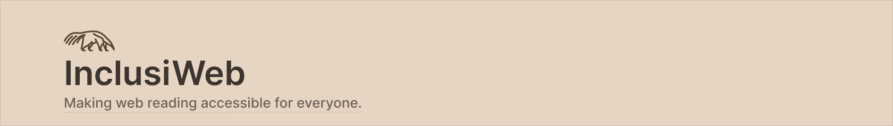

# InclusiWeb

<p align="center">
  
</p>

<p align="center">


</p>

---

## About the Project

InclusiWeb is an open-source Chrome extension that transforms any web page into a more accessible reading environment.

The project was originally developed as an academic project focused on **Web Accessibility**, with the goal of bringing together several accessibility features in a single, organized, and intuitive interface. Unlike many browser extensions that provide only one specific accessibility function, InclusiWeb combines multiple tools to improve the reading experience for users with different accessibility needs.

The extension was designed with simplicity, readability, and inclusion as its core principles.

---

## Inspiration

The project's symbol is the **Giant Anteater (_Myrmecophaga tridactyla_)**, an iconic species from the Brazilian fauna that is currently classified as vulnerable to extinction.

Besides representing Brazilian biodiversity, the giant anteater has naturally limited eyesight and relatively poor hearing. These characteristics inspired the visual identity of InclusiWeb, creating a symbolic connection with the project's mission of promoting digital accessibility for people with visual, cognitive, and reading difficulties.

---

## Features

- Reader Mode
- Adjustable font size
- High Contrast Mode
- Dyslexia-friendly font mode
- Text-to-Speech
- Hover-to-Read
- Paragraph highlighting during speech
- Clean and distraction-free reading interface
- Modern accessibility-oriented design

---

## Screenshots

### Reader Mode

> *(Insert screenshot here)*

```
images/reader.png
```

---

### High Contrast Mode

> *(Insert screenshot here)*

```
images/contrast.png
```

---

### Popup

> *(Insert screenshot here)*

```
images/popup.png
```

---

## Installation

Clone the repository

```bash
git clone https://github.com/your-username/InclusiWeb.git
```

Open Chrome and access

```
chrome://extensions
```

Enable **Developer Mode**, click **Load unpacked**, and select the project folder.

---

## Project Structure

```
InclusiWeb
│
├── content/
│
├── popup/
│
├── reader/
│   └── icons/
│
├── manifest.json
├── background.js
└── README.md
```

---

## Roadmap

InclusiWeb is currently in its first public version.

Several new features are already planned for future releases:

- Keyboard navigation
- Additional high-contrast themes
- More dyslexia-friendly fonts
- Multiple language support
- Brazilian Sign Language (Libras) support
- Settings page
- User preference persistence
- Interface improvements
- Better responsive design
- Performance optimizations

---

## Contributing

InclusiWeb is intended to remain an **open-source project**.

Contributions of any kind are welcome, whether through bug reports, suggestions, accessibility improvements, new features, or code contributions.

If you'd like to help make the web more accessible, feel free to open an Issue or submit a Pull Request.

---

## Why InclusiWeb?

Accessibility should not be treated as an optional feature.

InclusiWeb was created with the belief that reading on the web should be accessible to everyone, regardless of visual, cognitive, or learning limitations. This project represents a small contribution toward a more inclusive internet.

---

## License

This project was developed for educational purposes and is available as open source.
